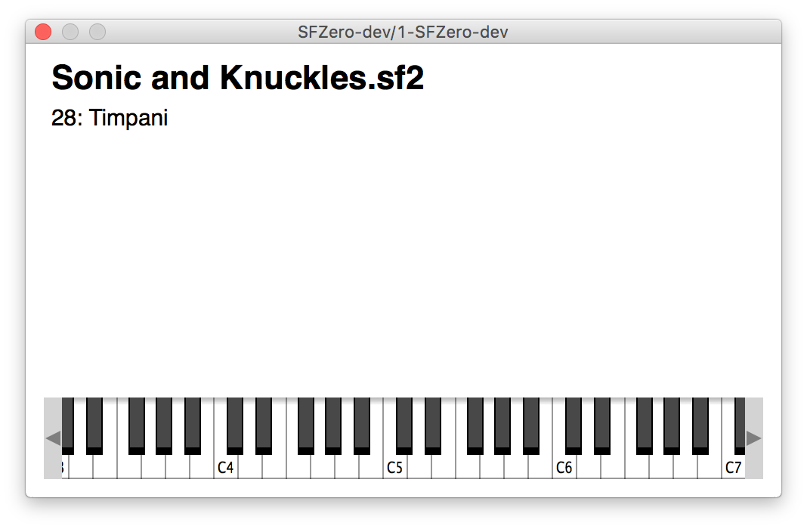

# SFZero
Updated source for XCode8/9, 64-bit audiounit and vst for macos.

Originally forked from https://github.com/stevefolta/SFZero

Extremely simple SF2/SFZ player. It didn't work at all with juce and didn't have 64 bit or au support so I updated it.

## Installing
Prebuilt binaries are available on the [releases](../../releases) page.

## Compiling
You can compile with Xcode 8 or 9, but this mess of a plug requires JUCE, which is like building a project in activex and flash and every bad technology ever invented all messed into one gumball of annoyance. HAVE FUN!

